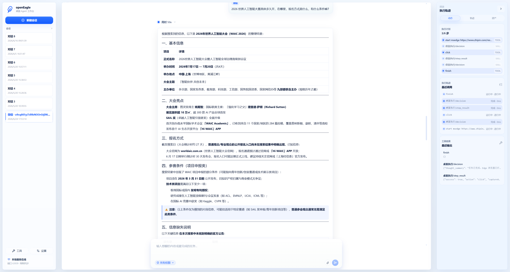

<p align="center">
  <h1 align="center">openEagle</h1>
  <p align="center">A desktop AI agent that sees your screen and acts on your behalf.</p>
</p>

<p align="center">
  <a href="./README.zh-CN.md">中文文档</a>
</p>

<p align="center">
  
  
  
</p>

---

> openEagle is still early. Rough edges are expected, and issues are very welcome.



## Why openEagle

Most AI assistants can chat and run commands. Very few can **look at your screen and actually do the work**.

openEagle bridges the gap between "understanding what you want" and "actually doing it on your desktop." You talk to one main agent. It can answer directly, use tools, delegate focused work, or dispatch a desktop execution worker that watches your screen and operates your mouse, keyboard, and applications — all while keeping you in control with a three-tier safety model.

There is no mode switch to choose. The main agent decides whether the right response is a natural answer, a tool-backed worker task, or visual desktop execution for GUI workflows such as navigating apps, filling forms, and completing multi-step operations.

> Tried so far:
>  - Using a browser directly to collect information
>  - Controlling desktop apps, such as play/pause in a music client
>  - Editing documents in Word
>  - ...

## Quick Start (5 minutes)

### Prerequisites

- [Node.js](https://nodejs.org/) (with corepack)
- [Python](https://python.org/) >= 3.12
- [uv](https://docs.astral.sh/uv/) (Python package manager)

### Install & Run

```bash
# Enable pnpm
corepack enable
corepack prepare pnpm@10.7.0 --activate

# Install frontend deps
pnpm install

# Install backend deps
uv sync --project ./backend

# Launch the app
pnpm electron:dev
```

That's it. `pnpm electron:dev` is the one-command dev launcher: it compiles the Electron main process, starts the Vite dev server, launches Electron, and then Electron starts the Python backend. Packaged builds use the Python sidecar. Either way, you do not need to start the server manually.

### Package & Release

```bash
pnpm package:windows
```

This builds the Python sidecar first, then creates a versioned Windows installer under `release/`, for example `openEagle-0.1.0-win-x64.exe`. The GitHub Actions workflow `Package Desktop` builds Windows, macOS, and Linux artifacts. Manual runs can fill `release_tag` such as `v0.1.0` to create or update a GitHub Release; leaving it empty creates downloadable workflow artifacts only. Pushing a `v*` tag also publishes the generated artifacts to the matching GitHub Release.

### Agent Eval Reports

The backend includes layered fixed agent regression sets for checking routing, worker choice, tool use, real workspace artifacts, and final-answer honesty after code changes. The default command runs the 20-task `core` set; set `AGENT_EVAL_REPORT_PROFILE=full` for the 100-task visible suite, or `holdout` / `variants` for anti-overfitting checks. Use `AGENT_EVAL_CATEGORIES` or `AGENT_EVAL_CAPABILITY_TAGS` to run only one functional area, such as command execution, instruction following, desktop operation, safety, or efficiency. From `backend`, run:

```powershell
uv run python tests/evals/run_agent_eval_report.py
```

The command writes JSON and Markdown reports to `backend/.deepeval/reports/agent-loop-latest.*`. Deterministic rules decide the success rate; the optional LLM Judge adds failure attribution and recommended fixes when `EVAL_MODEL_*` or `DEEPSEEK_*` credentials are available. Reports also separate product failures, efficiency issues, eval-contract issues, runtime/trace observations, and per-case token usage. See `backend/tests/evals/README.md` for smoke, holdout, variants, category filters, token reporting, and threshold modes.

### What's happening under the hood

```
Dev launcher  →  compiles Electron, starts Vite, then launches the desktop shell
Electron      →  starts uv/Python in dev, or the Python sidecar in packaged builds (random port)
Python        →  prints [AGENT_READY] WS_PORT: <port> to stdout
Electron      →  parses the port, notifies the frontend
Frontend      →  connects via WebSocket to ws://127.0.0.1:<port>/ws
```

## Architecture

```
┌──────────────────────────────────────────────────────┐
│                 Electron Shell (Node.js)               │
│  Process lifecycle · Screenshots · Input injection   │
│  Overlay window · Notifications                     │
├──────────────────────────────────────────────────────┤
│                Python Backend (FastAPI)               │
│  Main/Sub-agent runtime · Desktop execution · Tools │
│  Safety assessment · Prompt engine · Model routing   │
├──────────────────────────────────────────────────────┤
│               React Frontend (TypeScript)             │
│  Conversation UI · Desktop overlay · Activity panel  │
│  Settings · Dark/light theme · Responsive layout     │
└──────────────────────────────────────────────────────┘
         ↕ WebSocket (Envelope protocol)
```

### Tech Stack

| Layer | Technology |
|-------|-----------|
| Desktop shell | Electron 42, Node.js |
| Frontend | React 18, TypeScript, Vite |
| Backend | Python 3.12+, FastAPI, WebSocket |
| LLM | OpenAI-compatible API (configurable) |
| Vision | VL model via OpenAI-compatible endpoint |
| Automation | mss (screenshots), pyautogui (input) |
| Agent framework | LangGraph |
| Search | Tavily Search API (bring your own API key) |
| Scheduling | APScheduler + SQLite |
| Remote IM | Feishu long connection, Telegram Bot polling, WeChat ClawBot QR binding |

### Main/Sub-Agent Runtime

Every user message is handled by MainAgent first. MainAgent owns the user-facing conversation, keeps a bounded recent conversation window for follow-up phrases like "continue" or "look it up", answers simple requests directly, and delegates only when the task needs a focused worker, desktop execution, or asynchronous work. Workers use scoped internal conversation IDs, so task execution stays focused while the visible conversation only keeps summaries, evidence, and final results.

MainAgent's internal decision step is principle-driven rather than keyword-driven. It chooses workers by required capability, treats non-immediate time intent as a persistent task, and only asks clarifying questions when a missing detail would make an irreversible action completely wrong. Direct answers are returned in a dedicated `answer` field, while user-visible summaries are written in first person so the assistant reads like a collaborator instead of a system log.

Before delegated work starts, MainAgent may emit a short `server:agent_progress` message such as "I'll check that first." Worker execution, tool calls, and user-relevant memory operations are emitted as `server:trace` events. MainAgent's own internal decision JSON stays out of the Run calls UI.

When users ask for work to happen later or on a cadence, MainAgent creates a persistent scheduled task instead of doing the work immediately. Scheduled tasks are stored in `.open-eagle/scheduler.db`, use cron expressions for timing, run through the same worker kinds, and can report execution results back into the originating conversation.

### Memory & Context Management

openEagle now includes Hermes-inspired single-user long-term memory stored in `.open-eagle/memory.db`. Memory has four layers: user profile, user notes, Soul, and raw memory events. Raw events keep broader turn and compaction snapshots, while prompt injection uses a V2 retrieval layer: a bounded profile summary, a compact Soul summary, Agent side notes, and only active user notes relevant to the current request. Full memory remains available through built-in tools (`get_memory_state`, `save_memory_note`, `update_memory_note`, `delete_memory_note`, `save_user_profile`, `save_soul_core`, `save_agent_side_notes`), so "remember this" requests go through the memory database instead of creating project-root files. In Settings -> Memory, deleting a user note archives it and removes it from the active note list while preserving audit history.

Conversation turns are persisted in `.open-eagle/memory.db` by conversation ID, so desktop and remote IM sessions can continue after reconnects or restarts. The latest 30 full turns are kept by default (`context.conversationTurnLimit` is configurable); older turns are merged into an archive summary. Once the estimated prompt token threshold is reached, the backend preserves system messages and the latest N messages, then processes only the middle of the conversation. Tool messages are removed or replaced with compact placeholders before any AI summary step. Remote IM sessions schedule this compaction during the configured idle period instead of discarding the old context.

Built-in worker kinds:

| Worker | Use case |
|--------|----------|
| `general` | General explanation, light tool use, read-only checks |
| `coding` | Code edits, docs, builds, tests, file-changing work |
| `research` | Search, lookup, information gathering |
| `solo` | Internal worker id for visual desktop execution |

Read-only workers may run concurrently. Coding/write work and desktop execution are kept serial to avoid file and desktop conflicts.

### Desktop Execution — How It Works

Desktop execution is a **goal-driven worker**, not a task executor with a fixed plan:

1. **Observe** — captures a screenshot of your desktop
2. **Think** — VL model analyzes the image + task goal + history
3. **Act** — executes one action (click, type, scroll, etc.)
4. **Repeat** — loops until the task is complete or you stop it

The model autonomously decides what to do at each step. No pre-programmed scripts. No brittle selectors. Just visual understanding and reasoning.

The desktop execution worker uses soft stability signals instead of rigid scripts: action signatures detect true repeated actions, visual no-op and uncertain outcomes trigger recovery hints, and batch actions are only suppressed while recovering. Navigation-like actions such as `open_url`, click, double-click, and `press_keys` use short post-action screenshot stabilization so the next model step sees the loaded page instead of an early loading frame. This keeps the worker flexible for general tasks while still reducing repeated clicks and stalled screens.

### Remote IM Control

openEagle can accept tasks from Feishu, Telegram, or WeChat after you enable the provider in **Settings -> IM**.

- Feishu requires the app `App ID` and `App Secret`. The whitelist accepts either `open_id` for a single user or `chat_id` for a private chat/group chat. Send one message first, then copy the blocked `open_id` / `chat_id` from the IM status panel if you are not sure what to fill in.
- Telegram requires a Bot Token. The whitelist accepts either `user_id` or `chat_id`.
- WeChat uses `wechat-clawbot`. Click "Scan to bind" in the WeChat card, scan the QR code with WeChat, then enable the entry after the `accountId` is saved. "Unbind" stops polling and removes the local ClawBot account credentials used by openEagle.
- Empty whitelists reject all remote messages by default.
- Plain remote text is handled by the main agent first. It can reply naturally, use tools, or dispatch desktop execution when the task needs GUI control.
- After a remote session has been idle for `context.imIdleCleanupMinutes`, openEagle summarizes older context in the background while retaining recent full turns.
- Use `/solo <task>` only when you want to explicitly bias the request toward desktop execution.

Remote commands:

| Command | Behavior |
|---------|----------|
| `<plain text>` | Send the message to the main agent |
| `/solo <task>` | Explicitly request desktop execution |
| `/pause`, `/resume`, `/stop` | Control the current desktop execution task |
| `/allow`, `/reject` | Approve or reject pending confirmations |
| `/help` | Show command help |

### Safety Model

Every action is evaluated against a three-tier risk model:

| Level | Behavior |
|-------|----------|
| `safe` | Executes immediately (low-risk desktop actions, read-only tools, etc.) |
| `confirm` | Waits for your approval (file writes, delete/move actions, system shortcuts, etc.) |
| `blocked` | Refuses outright (dangerous commands like `rm -rf`) |

Additional guardrails: max 150 steps, action-signature duplicate detection, screenshot no-change detection, recovery-mode batch suppression, and feedback loops that return malformed actions or execution errors to the active agent for self-repair before surfacing them to the user.

## Configuration

openEagle supports flexible model routing — separate providers for main-agent text work and vision-language desktop execution, with configurable base URLs for any OpenAI-compatible API.

Key settings (accessible from the in-app Settings panel):

| Setting | Description |
|---------|-------------|
| `agent.provider` | Text model provider (`openai`, `openai-like`, `mock`) |
| `agent.modelId` | Text model for the main agent and direct conversation |
| `agent.baseUrl` | Custom OpenAI-compatible API base URL |
| `agent.vlProvider` | Vision model provider (`openai`, `openai-like`) |
| `agent.vlModelId` | Vision-Language model for desktop execution |
| `agent.vlBaseUrl` | OpenAI-compatible API base URL for the vision model |
| `webSearch.provider` | Built-in search provider (`tavily` or `disabled`) |
| `webSearch.apiKey` | Tavily API key; `TAVILY_API_KEY` is also supported |
| `webSearch.searchDepth` / `webSearch.maxResults` | Search depth and default result count |
| `feishu.enabled` | Enable the Feishu remote entry |
| `feishu.appId` / `feishu.appSecret` | Feishu app credentials for long-connection events |
| `feishu.allowedOpenIds` / `feishu.allowedChatIds` | Feishu user/chat whitelist |
| `telegram.enabled` | Enable the Telegram remote entry |
| `telegram.botToken` | Telegram Bot API token |
| `telegram.allowedUserIds` / `telegram.allowedChatIds` | Telegram user/chat whitelist |
| `wechat.enabled` | Enable the WeChat ClawBot remote entry |
| `wechat.accountId` | WeChat ClawBot account saved after QR binding |
| `wechat.baseUrl` / `wechat.botType` | Optional ClawBot API base URL and bot type |
| `wechat.allowedUserIds` / `wechat.allowedChatIds` | WeChat user/chat whitelist |
| `context.maxInputTokens` | Estimated input token threshold for context cleanup |
| `context.conversationTurnLimit` | Full conversation turns persisted per conversation (default: 30) |
| `context.preserveRecentMessages` | Number of recent messages preserved exactly during cleanup |
| `context.toolMessageMode` | Whether middle tool messages are compacted to placeholders or removed |
| `context.aiSummaryEnabled` | Enables AI summaries for middle conversation context |
| `context.snapshotOnCompaction` | Writes a memory snapshot before compaction |
| `tools` | Custom command tools ([see below](#tool--custom-command-tools)) |
| `mcp` | MCP server connections, stored in `.open-eagle/mcp.json` ([see below](#mcp--connect-external-services)) |
| `skills` | Custom skill directives, stored under `.open-eagle/skills/` ([see below](#skill--inject-domain-specific-knowledge)) |

Model settings, web-search credentials, IM, context, and UI preferences are saved in the local `.open-eagle/settings.json`. MCP and Skill definitions are file-backed so they can be reviewed, copied between machines, or versioned separately from runtime preferences. The Tavily API key is never written to `.open-eagle/mcp.json`. Older `settings.json` files that still contain `mcp` or `skills` arrays are migrated automatically on startup.

### Langfuse tracing

The Python backend includes optional Langfuse tracing for main-agent requests, solo desktop runs, OpenAI/OpenAI-compatible and Anthropic generations, token usage, latency, errors, and nested tool calls. Configure credentials in the environment before starting openEagle:

```powershell
$env:LANGFUSE_PUBLIC_KEY = "pk-lf-..."
$env:LANGFUSE_SECRET_KEY = "sk-lf-..."
$env:LANGFUSE_BASE_URL = "https://us.cloud.langfuse.com"
$env:LANGFUSE_TRACING_ENVIRONMENT = "development"
pnpm electron:dev
```

Conversation IDs are pseudonymized before being used as Langfuse session IDs. Raw prompts, replies, tool payloads, screenshots, and attachment contents are not exported by default; traces retain model, token, latency, route, size, and hierarchy information. Set `LANGFUSE_CAPTURE_CONTENT=true` only when the project data policy allows redacted content capture. `LANGFUSE_SAMPLE_RATE` controls sampling, and `LANGFUSE_TRACING_ENABLED=false` disables tracing without code changes.

## Tools, MCP & Skills

openEagle's capabilities don't stop at the built-ins. Three extension mechanisms let you customize everything from what the agent *can do* to *how it does it*.

### Tool — Custom Command Tools

A Tool is the simplest extension: give the agent a shell command template, and it can call it during conversation or desktop execution.

Add tools in **Settings -> Tools**:

| Field | Description |
|-------|-------------|
| `name` | Tool name — the agent uses this and the description to decide when to invoke it |
| `command` | Shell command template with `{placeholder}` parameters the agent fills in |
| `description` | Tells the agent what this tool does and when to use it |
| `cwd` | Working directory (optional) |
| `timeout_ms` | Timeout, defaults to 30 seconds |

**Example**: A `run_tests` tool with command `uv run python -m pytest {test_path} -v` and description "Run pytest tests at the given path." The agent will pick it up automatically when it needs to run tests.

### MCP — Connect External Services

openEagle supports the [Model Context Protocol (MCP)](https://modelcontextprotocol.io/), so you can plug in any MCP server's tools. This lets you reuse the entire MCP ecosystem without writing integration code.

Configure in **Settings -> MCP** with three transport types:

| Transport | Description | Use case |
|-----------|-------------|----------|
| `stdio` | Launches a local process | Local MCP servers |
| `sse` | Server-Sent Events | Remote MCP servers |
| `http` | Streamable HTTP | Remote MCP servers |

Example (stdio): `id: "my-mcp"`, `name: "My MCP Server"`, `transport: "stdio"`, `endpoint: "npx -y @some/mcp-server"`

MCP tools are available in both desktop execution and chat. In default permission mode, MCP calls require user confirmation.

MCP definitions are persisted in `.open-eagle/mcp.json`:

```json
{
  "version": 1,
  "servers": [
    {
      "id": "my-mcp",
      "name": "My MCP Server",
      "transport": "stdio",
      "endpoint": "npx -y @some/mcp-server",
      "description": "Provides project-specific tools.",
      "enabled": true
    }
  ]
}
```

openEagle can also read common Claude-style `mcpServers` JSON and normalizes it into the same in-app MCP list.

### Skill — Inject Domain-Specific Knowledge

Skill is openEagle's most distinctive extension. It doesn't execute code — it **injects a behavioral directive** into the agent: "When you encounter this kind of task, follow this approach instead of the generic one."

This solves a core problem: **general-purpose models take the well-known path, but your workflow has private knowledge**. For example:

- Your company's deploy process isn't `docker compose up` — it's a custom script chain
- You follow specific file organization, naming conventions, or commit styles
- The correct sequence for an operation differs from what a web search would suggest

Skills let you "teach" the agent your experience so it follows your way automatically.

Add skills in **Settings -> Skills**:

| Field | Description |
|-------|-------------|
| `name` | Skill name |
| `description` | One-line summary of when this skill applies |
| `prompt` | The full behavioral directive — the more specific, the better |

**Example**:

```
name: "Project Deploy"
description: "Correct procedure for deploying to the test environment"
prompt: |
  When deploying to the test environment, do NOT use docker compose.
  Correct steps:
  1. Run scripts/build.sh
  2. Run scripts/deploy-test.sh
  3. Check health: curl http://test.internal:8080/health
  4. If it fails, rollback: scripts/rollback.sh
```

**How it works**:

- **Auto-activated**: Enabled skills are injected into the system prompt during desktop execution. The agent matches them against the current task via the skill description.
- **Manual selection**: Type `/skill <name>` in chat to explicitly apply a skill for the current turn.

> Skills are **structured transfer of experience**. You don't write code — you just write down "the right way to do it," and the agent follows. This is far more reliable than letting the model guess or search for generic solutions.

Skills are persisted as portable folders:

```
.open-eagle/
  skills/
    project-deploy/
      skill.json
      SKILL.md
```

`skill.json` stores metadata such as `id`, `name`, `description`, and `enabled`. `SKILL.md` stores the full directive, so skills from other file-based agents can be copied into openEagle with minimal editing. If `SKILL.md` contains front matter with `name` or `description`, openEagle uses it when `skill.json` is absent. Removing a skill from Settings archives its folder under `.open-eagle/deleted-skills/` instead of deleting it permanently.

### How They Fit Together

```
                ┌─────────────────────────────────┐
                │          Agent Decision          │
                │  "How should I do this task?"    │
                └──────────┬──────────────────────┘
                           │
            ┌──────────────┼──────────────────┐
            ▼              ▼                  ▼
     ┌──────────┐   ┌──────────┐      ┌──────────┐
     │   Tool   │   │   MCP    │      │  Skill   │
     │  Execute │   │ External │      │Behavioral│
     │ Command  │   │ Capabil. │      │Directive │
     │          │   │          │      │          │
     │  "What"  │   │  "With"  │      │   "How"  │
     └──────────┘   └──────────┘      └──────────┘
```

- **Tool** defines what commands the agent can run
- **MCP** defines what external capabilities are available
- **Skill** defines how the agent approaches specific scenarios

All three compose. For example: an MCP server that provides database queries, a Skill that encodes your team's query conventions, and a Tool that wraps a common analysis script — the agent will combine them automatically when the context fits.

## Roadmap

- [x] Clearer execution status when you leave the main window (structured overlay HUD)
- [ ] Faster responses and actions (prompt caching, etc.)
- [ ] macOS and Linux support
- [ ] Community plugin system
- [ ] Session replay and richer history
- [ ] Voice input
- [x] Hermes-style long-term memory: user profile, user notes, Soul, raw events, and built-in memory tools
- [x] Configurable context cleanup: token threshold, recent-message preservation, tool pre-cleaning, AI middle summaries, and IM idle windows
- [x] Scheduled tasks with persistent storage, worker execution, UI management, and run history
- [x] MainAgent-led delegation, bounded follow-up context, natural progress messages, visible worker/tool/memory traces, and assistant-style direct answers
- [x] Multi-monitor awareness (display selection and runtime switching supported)
- [x] Model support: OpenAI-compatible API + Anthropic Claude native provider

## Contributing

Contributions are welcome! Here's how to get started:

1. **Fork** the repository
2. **Clone** your fork: `git clone https://github.com/YOUR_USERNAME/openEagle.git`
3. **Create** a branch: `git checkout -b feature/my-feature`
4. **Make** your changes
5. **Verify** before committing:
   ```bash
   pnpm -s tsc --noEmit          # Frontend type check
   uv run python -m compileall backend/app  # Backend syntax check
   pnpm exec tsc -p tsconfig.electron.json --noEmit  # Electron main process check
   ```
6. **Commit** with a clear message following [Conventional Commits](https://www.conventionalcommits.org/):
   ```
   feat: add multi-monitor support
   fix: resolve overlay position on ultrawide displays
   ```
7. **Push** and open a Pull Request

### Areas Where Help Is Needed

- **Desktop execution reliability** — testing across different applications and workflows
- **Context management** — stronger context strategies inspired by tools like OpenClaw and Hermes
- **Cross-platform** — macOS and Linux adaptation
- **Tools & integrations** — new built-in tools, MCP servers, skills
- **UI motion** — better visual design and interaction polish
- **Documentation** — guides, tutorials, translations
- **Tests** — backend unit tests, frontend component tests

See [AGENT.md](./AGENT.md) for detailed coding conventions.

## License

[MIT](./LICENSE)

---

<p align="center">
  Built with curiosity and too many screenshots.
</p>
